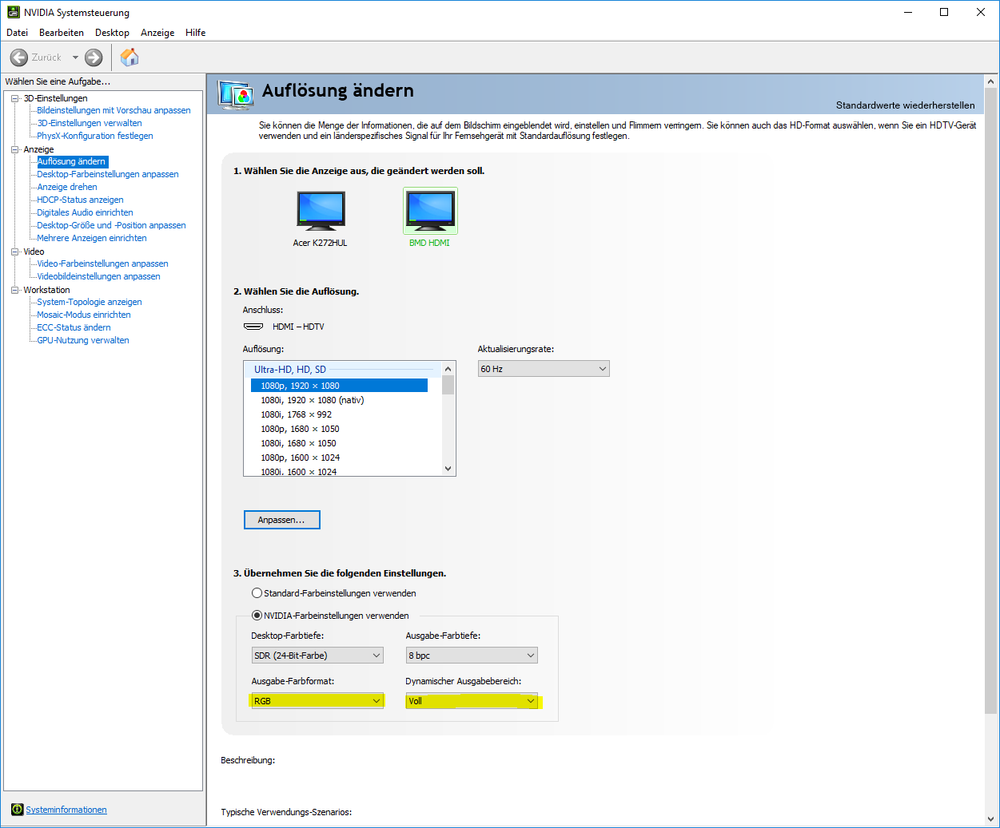

# VVVV Decklink

## Setup
:warning: Mind that you might need the latest BlackMagic Driver (11.2)

1. Obtain the DeckLink SDK
    A. Download the BlackMagic SDK from
    [blackmagicdesign.com/developer](https://www.blackmagicdesign.com/de/developer/)
    (*Developer SDK/Desktop Video SDK* under **Latest Downloads**)
    B. Get it from the BOX: `Current\Ongoing\1904_SoftwarePack\SDKs`
2. Unzip the SDK package into the root of `bm.decklink`
3. Open `VVVV.Nodes.BlackMagic.sln` and build the project

## Deploy
The solution will build the `.dll` files right into the `Patches/` folder. Use
`release.bat vvvv.nodes.blackmagic` to copy all the files into the `Release/`
dir for usage with the vvvv packs dir.

## HDMI Input
If a black picture is experienced, you may have to change the pixel format on the input format. This happens mostly with Nvidia cards providing the input signal. You can change the pixel color output format in the Nvidia control panel:

## Helpful Links
- [DeckLinkCapabilities: A Printout of Capabilities of Blackmagic Design/DeckLink Hardware](http://alax.info/blog/1454)
- [Correcting HDMI Colour on Nvidia and AMD GPUs](https://pcmonitors.info/articles/correcting-hdmi-colour-on-nvidia-and-amd-gpus/)